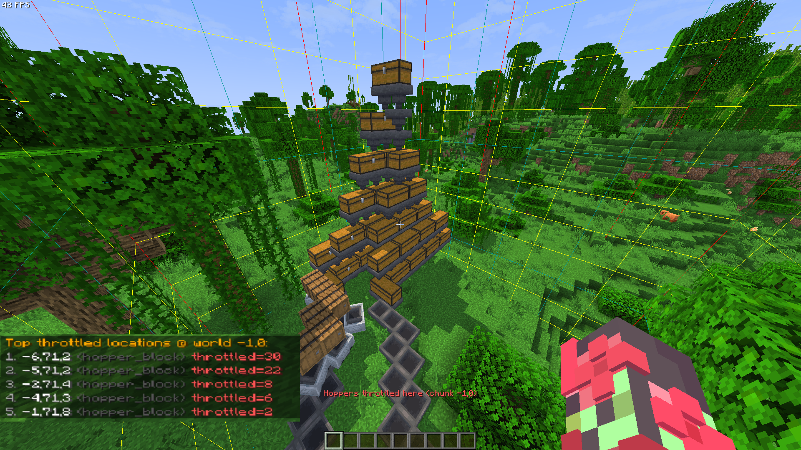

# HopperFlow Governor

> ⚖️ Smart hopper & inventory-move throttling for Minecraft servers (1.21+).  
> Keep TPS high without breaking vanilla mechanics — no NMS, no item loss.

[](https://github.com/nolly-mc/HopperFlowGovernor/actions)
[](LICENSE)
[](https://bstats.org/plugin/bukkit/HopperFlowGovernor)

---

## ✨ Features

- 🛡️ **Protects TPS** — throttles only the *extra* hopper / dropper / dispenser / hopper-minecart moves per tick.
- ⚙️ **Fully configurable** — per-chunk, per-type, and global rate limits with burst tokens.
- 📊 **Real-time diagnostics** — `/hopperflow inspect`, `/detail`, `/where`, `/top`.
- 🚫 **No NMS hacks** — pure Spigot API; forward-compatible across versions.
- 🎮 **Player-friendly** — no item loss, optional actionbar notices when throttling happens nearby.
- 🗺️ **WorldGuard integration** — exempt specific regions seamlessly.
- 🧩 **Exemptions** — by world, region, or container name prefix (e.g. `[FAST]` hoppers).
- 📈 **Optional metrics** — bStats (opt-in) for server owners who want usage stats.
- 🔒 **Minimal overhead** — optimized for large servers with thousands of hoppers.

---

</img> </img> </img> </img> </img> </img>

---

## 📥 Installation

1. Download the latest release from [SpigotMC]() / [Modrinth]().
2. Drop `HopperFlowGovernor-x.x.x.jar` into your server’s `plugins/` folder.
3. Restart the server. A default `config.yml` will be created.

---

## ⚙️ Configuration

The default `config.yml` comes heavily commented:

```yml
# HopperFlow Governor — caps inventory move events to stabilize TPS.
# Pure Bukkit. No item loss. Cancels only excess moves per tick window.

# Global per-chunk defaults (used when no per-type override exists)
rate_per_chunk_per_sec: 80          # default average moves/s per chunk
burst_per_chunk: 120                # default short-term burst tokens per chunk

# Global ceiling across all chunks
max_global_rate: 5000               # average moves/s allowed globally

# Optional per-type overrides; omit or set null to use the global defaults above
per_type_limits:
  hopper_block: { rate: 80, burst: 120 }
  hopper_minecart: { rate: 40, burst: 80 }
  dropper: { rate: 40, burst: 80 }
  dispenser: { rate: 20, burst: 40 }

# Which initiators are governed?
include:
  hopper_blocks: true               # vanilla block hoppers
  hopper_minecarts: false           # hopper minecart entities
  droppers: false                   # droppers pushing into inventories
  dispensers: false                 # dispensers pushing into inventories

# Name-prefix exemptions per type (renaming the container/minecart bypasses throttle)
exempt_name_prefixes:
  hopper_block: "[FAST]"
  hopper_minecart: ""
  dropper: ""
  dispenser: ""

# World and WorldGuard exemptions
exempt_worlds: [ the_end ]
exempt_regions: [ ]                 # WG region IDs (if WorldGuard is installed)

# Player feedback
notify_players_near_throttle: true
notify_radius: 16

# Accounting window + cleanup
stats_window_seconds: 60            # time window used by /inspect, /detail, /where, /top
cleanup_after_minutes: 15           # drop idle chunk stats/buckets

# Telemetry (bStats) — opt-in.
metrics:
  enabled: true
```

---

## 🖥️ Commands & Permissions

| Command                 | Permission                   | Default | Description                                              |
|-------------------------|------------------------------|---------|----------------------------------------------------------|
| `/hopperflow help`      | `hopperflow.command.help`    | OP      | Shows help message                                       |
| `/hopperflow reload`    | `hopperflow.command.reload`  | OP      | Reloads config.yml                                       |
| `/hopperflow inspect`   | `hopperflow.command.inspect` | OP      | Shows summary for current chunk                          |
| `/hopperflow detail`    | `hopperflow.command.detail`  | OP      | Per-initiator breakdown (hoppers, droppers, etc.)        |
| `/hopperflow where [N]` | `hopperflow.command.where`   | OP      | Lists top throttled block/entity locations in this chunk |
| `/hopperflow top [N]`   | `hopperflow.command.top`     | OP      | Ranks chunks globally by throttling                      |

**Aliases:** `/hflow`, `/hfg`

---

## 🔍 Example Usage

* Rename a hopper to `[FAST]` → **it bypasses limits** (custom sorters, farms).
* `/hopperflow top 5` → list 5 worst offending chunks in the last 60s.
* `/hopperflow where 10` → find the **exact block coordinates** being throttled.
* Place hoppers inside a WorldGuard region → exempt automatically if region ID is listed.

---

## 📈 Metrics

* [bStats](https://bstats.org/) integration is included but **disabled by default** (`metrics.enabled: false`).
* If enabled, the plugin will anonymously report:

    * HopperFlowGovernor version
    * Minecraft version
    * Server count
* No personal or identifying data is collected.
* The use case for metrics is to help prioritize future development based on usage patterns.

---

## 🔧 Performance Notes

* This plugin does **not** delete or void items.
* It only cancels *extra* `InventoryMoveItemEvent` calls beyond configured thresholds.
* Works safely alongside plugins like ClearLag, WorldGuard, and Paper’s async chunk system.

---

## 📚 API / Compatibility

* Pure **Bukkit/Spigot API** — no Paper-only hooks, no NMS.
* Compatible with Paper, Spigot, Purpur (tested on 1.21+).
* WorldGuard integration is optional (soft-depend).

---

## 🤝 Contributing

1. Fork this repo & clone locally.
2. Run `mvn package` to build.
3. Test in a local Paper server (`/plugins/`).
4. Submit a PR with clear commit history.

Bug reports & feature requests → [GitHub Issues](https://github.com/nolly-mc/HopperFlowGovernor/issues).

---

## 📜 License

This project is licensed under the [MIT License](LICENSE).

---

## ❤️ Credits

* Developed by **Nolly** ([@TheNolle](https://github.com/thenolle))
* Inspired by community feedback on hopper lag issues
* Thanks to [bStats](https://bstats.org/) and [SpigotMC](https://spigotmc.org/) for tooling
